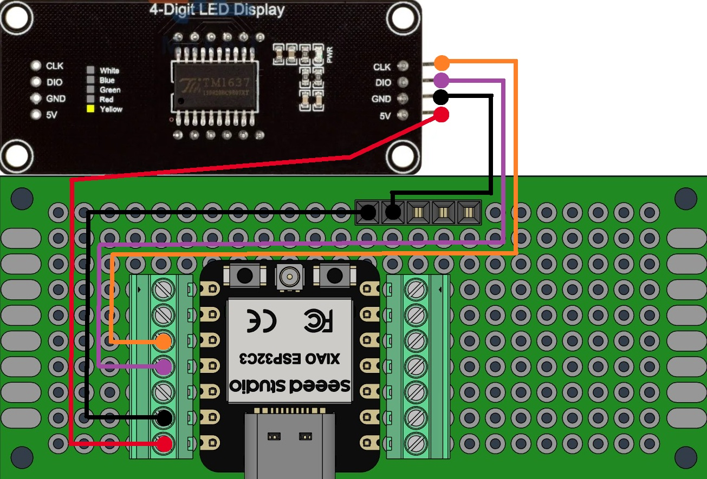
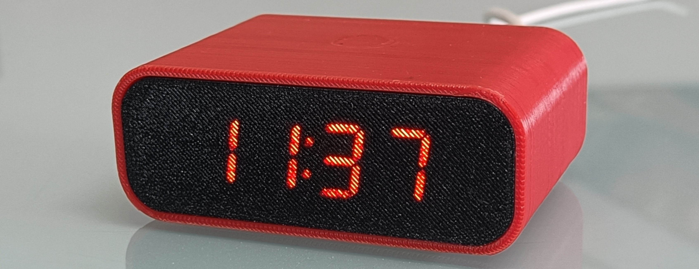
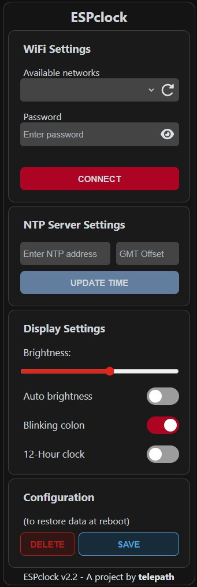
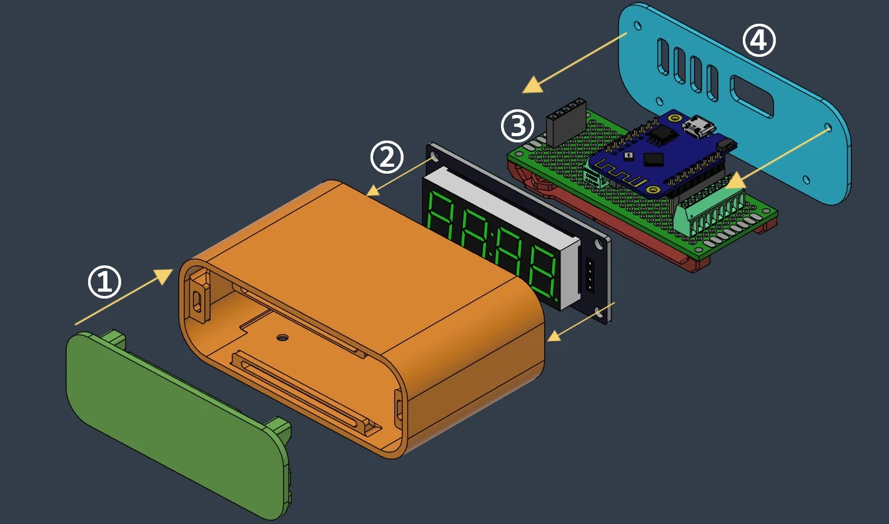

  

## Creator: [telepath9](https://github.com/telepath9)

We sincerely thank the original author and contributors of [**ESPclock**](https://github.com/telepath9/ESPclock) for their open-source work, which forms the foundation of this project.

## Project Description
A smart NTP network clock powered by Seeed Studio XIAO ESP32 C3. Connects to your home Wi-Fi, fetches time from an NTP server, and displays it on a TM1637 7-segment display. Features a mobile-friendly Web UI for configuring Wi-Fi, NTP server, timezone, brightness, and more — all settings persist across reboots via LittleFS.

## Key Features
- 🌐 NTP network time sync, always accurate
- 📱 Mobile-friendly Web UI for configuration
- 💾 Settings persist across reboots (LittleFS)
- 💡 Auto brightness mode (darker at night, brighter in daylight)
- ⏱️ Toggle colon blink, 12/24-hour format
- 🔧 Built for Seeed Studio XIAO ESP32 C3

## Hardware & Software
- **Hardware components:**
  - Seeed Studio XIAO ESP32 C3
  - TM1637 4-digit 7-segment display module
  - Jumper wires, perfboard (optional 3D-printed case)
- **Software / frameworks:**
  - PlatformIO (build tool)
  - ESPAsyncWebServer (async web server)
  - LittleFS (flash filesystem)
  - ESPmDNS (access via `espclock.local`)
- **Programming language:** C++

## Quick Start

### Hardware Connection

| XIAO ESP32 C3 | TM1637 Display |
|----------------|----------------|
| GPIO 9         | CLK            |
| GPIO 10        | DIO            |
| 3V3            | VCC            |
| GND            | GND            |

### Software Configuration
  1. Install [VSCode](https://code.visualstudio.com/) or [VSCodium](https://vscodium.com/)
  2. Install **PlatformIO IDE** extension
  3. Clone or download the project, open `esp32/` directory

  

  
  

  4. Build and flash:
     - `Platform → Build filesystem image` (upload web UI to flash)
     - `Platform → Upload` (flash firmware)
  5. Connect to ESP's AP (SSID: `ESPclock32`, password: `waltwhite64`)
  6. Open `http://192.168.4.1/` or `http://espclock.local/` in your browser

  

  
  

  7. Configure your home Wi-Fi, NTP server, and timezone via the Web UI

  8. Once everything is working, assemble the hardware and enclose it in the case

  

  
  

