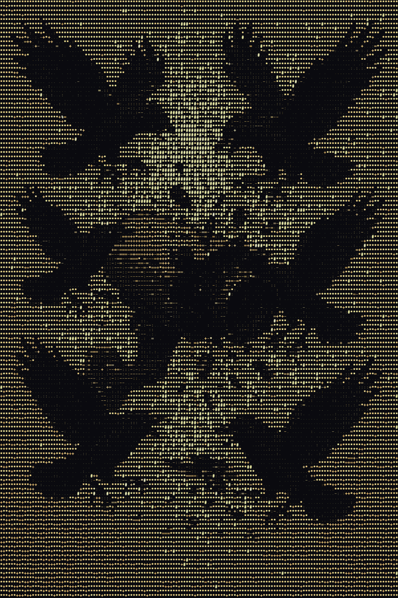

# XIAO_ESP32_S3_BLE_SurveillanceDetector

<div align="center">

<br/><br/>

[](https://platformio.org/)
[](https://www.seeedstudio.com/xiao-series-page)
[](https://www.python.org/)
[](https://en.wikipedia.org/wiki/Bluetooth_Low_Energy)
</div>

## Creator: [colonelpanichacks](https://github.com/colonelpanichacks)

We sincerely thank the original author and contributors of [**flock-you**](https://github.com/colonelpanichacks/flock-you) for their open-source work, which forms the foundation of this project.

## Project Description
A standalone BLE surveillance device detector powered by Seeed Studio XIAO ESP32-S3. Detects Flock Safety cameras, Raven gunshot detectors, and related monitoring hardware using BLE-only heuristics. Runs a Wi-Fi access point with a live web dashboard on your phone, tags detections with GPS from your phone's browser, and exports data as JSON, CSV, or KML for Google Earth.

## Key Features
- 📡 BLE-based detection of Flock Safety cameras & Raven gunshot detectors
- 🌐 Wi-Fi AP web dashboard (live feed, pattern database, export tools)
- 📍 GPS wardriving — phone GPS tags every detection with coordinates
- 💾 Session persistence — auto-saves to flash every 60 seconds
- 📤 Export formats: JSON, CSV, KML (Google Earth)
- 🔊 Audio alerts — crow call sounds on new device detection
- 🖥️ Flask companion app for desktop data analysis

## Hardware & Software
- **Hardware components:**
  - Seeed Studio XIAO ESP32-S3
  - Piezo buzzer (GPIO 3)
  - LED (GPIO 21, optional)
- **Software / frameworks:**
  - PlatformIO (build tool)
  - NimBLE-Arduino (BLE scanning)
  - ESP Async WebServer + AsyncTCP (web dashboard)
  - ArduinoJson (JSON serialization)
  - SPIFFS (session persistence)
  - Flask (desktop companion app)
- **Programming language:** C++ / Python

## Quick Start

### Hardware Connection
<div align="center">

| XIAO ESP32-S3 | Function |
|----------------|----------|
| GPIO 3        | Piezo buzzer |
| GPIO 21       | LED (optional) |

</div>

### Software Configuration
  1. Install [VSCode](https://code.visualstudio.com/) or [VSCodium](https://vscodium.com/)
  2. Install **PlatformIO IDE** extension in VSCode/VSCodium
  3. Clone or download the project and open it in VSCode/VSCodium
  4. Build and flash via PlatformIO:
     - `Platform → Build` — compile the firmware
     - `Platform → Upload` — flash to XIAO ESP32-S3
     - `Platform → Monitor` — view serial output
  5. Connect to the AP (SSID: `flockyou`, password: `flockyou123`)
  6. Open `http://192.168.4.1/` in your browser
  7. Tap the **GPS** card in the stats bar to enable geolocation (Android Chrome required)

### Flask Companion App
  The `api/` folder contains a Flask desktop application for analyzing detection data.

  ```bash
  cd api
  pip install -r requirements.txt
  python flockyou.py
  ```
  Open `http://localhost:5000` to view the desktop dashboard. Detection logs exported from the ESP32 can be imported as JSON, CSV, or KML files.

## Detection Methods

All detection is BLE-based:

| Method | Description |
|--------|-------------|
| **MAC prefix** | 20 known Flock Safety OUI prefixes (FS Ext Battery, Flock WiFi modules) |
| **BLE device name** | Case-insensitive match: `FS Ext Battery`, `Penguin`, `Flock`, `Pigvision` |
| **Manufacturer ID** | `0x09C8` (XUNTONG) — catches devices with no broadcast name |
| **Raven service UUID** | Identifies Raven gunshot detectors by BLE GATT service UUIDs |
| **Raven FW estimation** | Determines firmware version (1.1.x / 1.2.x / 1.3.x) from advertised service patterns |

## Raven Gunshot Detector Detection

Flock-You identifies SoundThinking/ShotSpotter Raven devices through BLE service UUID fingerprinting:

| Service | UUID | Description |
|---------|------|-------------|
| Device Info | `0000180a-...` | Serial, model, firmware |
| GPS | `00003100-...` | Real-time coordinates |
| Power | `00003200-...` | Battery & solar status |
| Network | `00003300-...` | LTE/WiFi connectivity |
| Upload | `00003400-...` | Data transmission metrics |
| Error | `00003500-...` | Diagnostics & error logs |
| Health (legacy) | `00001809-...` | Firmware 1.1.x |
| Location (legacy) | `00001819-...` | Firmware 1.1.x |

Firmware version is estimated automatically from which service UUIDs are advertised.

## OUI-SPY Firmware Ecosystem

Flock-You is part of the OUI-SPY firmware family:

| Firmware | Description | Board |
|----------|-------------|-------|
| **[OUI-SPY Unified](https://github.com/colonelpanichacks/oui-spy-unified-blue)** | Multi-mode BLE + WiFi detector | ESP32-S3 / ESP32-C5 |
| **[OUI-SPY Detector](https://github.com/colonelpanichacks/ouispy-detector)** | Targeted BLE scanner with OUI filtering | ESP32-S3 |
| **[OUI-SPY Foxhunter](https://github.com/colonelpanichacks/ouispy-foxhunter)** | RSSI-based proximity tracker | ESP32-S3 |
| **[Flock You](https://github.com/colonelpanichacks/flock-you)** | Flock Safety / Raven surveillance detection | ESP32-S3 |
| **[Sky-Spy](https://github.com/colonelpanichacks/Sky-Spy)** | Drone Remote ID detection | ESP32-S3 / ESP32-C5 |
| **[Remote-ID-Spoofer](https://github.com/colonelpanichacks/Remote-ID-Spoofer)** | WiFi Remote ID spoofer & simulator | ESP32-S3 |
| **[OUI-SPY UniPwn](https://github.com/colonelpanichacks/Oui-Spy-UniPwn)** | Unitree robot exploitation system | ESP32-S3 |

## Acknowledgments

- **Will Greenberg** ([@wgreenberg](https://github.com/wgreenberg)) — BLE manufacturer company ID detection (`0x09C8` XUNTONG) sourced from his [flock-you](https://github.com/wgreenberg/flock-you) fork
- **[DeFlock](https://deflock.me)** ([FoggedLens/deflock](https://github.com/FoggedLens/deflock)) — crowdsourced ALPR location data and detection methodologies
- **[GainSec](https://github.com/GainSec)** — Raven BLE service UUID dataset (`raven_configurations.json`) enabling detection of SoundThinking/ShotSpotter acoustic surveillance devices

## Disclaimer

This tool is intended for security research, privacy auditing, and educational purposes. Detecting the presence of surveillance hardware in public spaces is legal in most jurisdictions. Always comply with local laws regarding wireless scanning and signal interception. The authors are not responsible for misuse.
