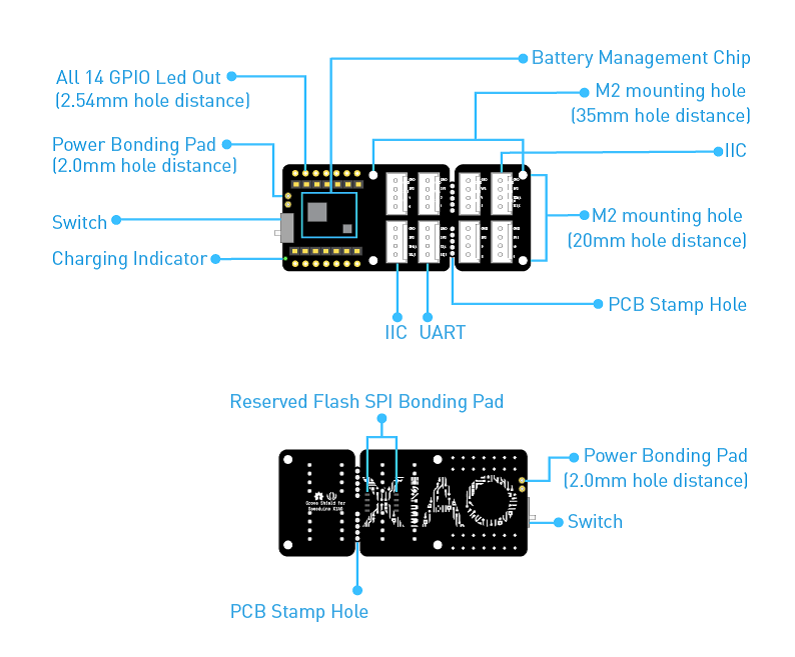

# XIAO RP2040 Serprog

<p align="center">
    
</p>

<p align="center">
  
  
  
  
</p>

---

## Creator

[**Thomas Roth (stacksmashing)**](https://github.com/stacksmashing)

> This project is a fork of [**pico-serprog**](https://github.com/stacksmashing/pico-serprog). We sincerely thank the original author and contributors for their open-source work, which forms the foundation of this project.

---

## Project Overview

**XIAO RP2040 Serprog** is a **flashrom/serprog-compatible SPI flash reader/writer** firmware for the Seeed Studio XIAO RP2040 board. It implements the Serial Flasher Protocol, allowing flashrom to program, read, and erase SPI flash chips directly via USB.

The firmware leverages the **RP2040 PIO (Programmable I/O)** to bit-bang SPI at high speeds without CPU intervention, achieving stable communication with a wide range of SPI flash chips. No custom flashrom build or manual compilation is required — it works with the standard flashrom release and pre-built firmware.

---

## Table of Contents

- [What You Need](#what-you-need)
- [Quick Start](#quick-start)
- [License](#license)

---

## What You Need

### Hardware

<p align="center">
    
</p>

| Component | Description |
|-----------|-------------|
| **Seeed Studio XIAO RP2040** | Main board |
| **Grove Shield for XIAO** (or Grove Base for XIAO) | Expansion board with SPI flash pad on the bottom |
| **SPI Flash chip** | SOIC-8 package, connected via the Shield's bottom SPI pad |
| **USB-C cable** | Data-capable |

The SPI flash chip is connected through the **solder pad on the underside** of the Grove Shield — no extra breadboard or Dupont wires needed.

### Software

| Tool | Purpose |
|------|---------|
| **flashrom** | Open-source SPI flash programming utility |

Download flashrom for your OS: [flashrom.org/Downloads](https://flashrom.org/Downloads)

---

## Quick Start

### Step 1 — Download the Firmware

The firmware is automatically built by **GitHub Actions** on every release. Download the pre-built `pico_serprog.uf2` from the Actions artifact:

> Go to the repository's **Actions** tab → select a workflow run → download the `pico_serprog.uf2` artifact.

### Step 2 — Flash the Firmware to XIAO RP2040

1. Hold the **BOOT** button on the XIAO RP2040
2. Press and release the **RESET** button while holding BOOT
3. The board will appear as a removable drive (RPI-RP2) in your file manager
4. Copy `pico_serprog.uf2` onto that drive

The XIAO RP2040 will automatically reboot and run the serprog firmware. The **D17 red LED** blinks during command processing.

### Step 3 — Find the Device Port

On Linux/macOS, the XIAO RP2040 will appear as a USB serial device:

```bash
ls /dev/ttyACM*
# or
ls /dev/ttyUSB*
```

Common device names: `/dev/ttyACM0` (Linux) or `/dev/cu.usbmodemXXX` (macOS).

### Step 4 — Use flashrom

```bash
# Read flash contents (replace /dev/ttyACM0 with your device)
flashrom -p serprog:dev=/dev/ttyACM0:115200,spispeed=12M -r flash_dump.bin

# Write flash contents
flashrom -p serprog:dev=/dev/ttyACM0:115200,spispeed=12M -w flash_dump.bin

# Verify write
flashrom -p serprog:dev=/dev/ttyACM0:115200,spispeed=12M -v flash_dump.bin
```

> **Tip:** Adjust `spispeed` based on your flash chip specs. Common values: `8M`, `12M`, `20M`. If you encounter errors, lower the speed.

---

## License

This project is licensed under **GPLv3** (see [COPYING](./COPYING)).
